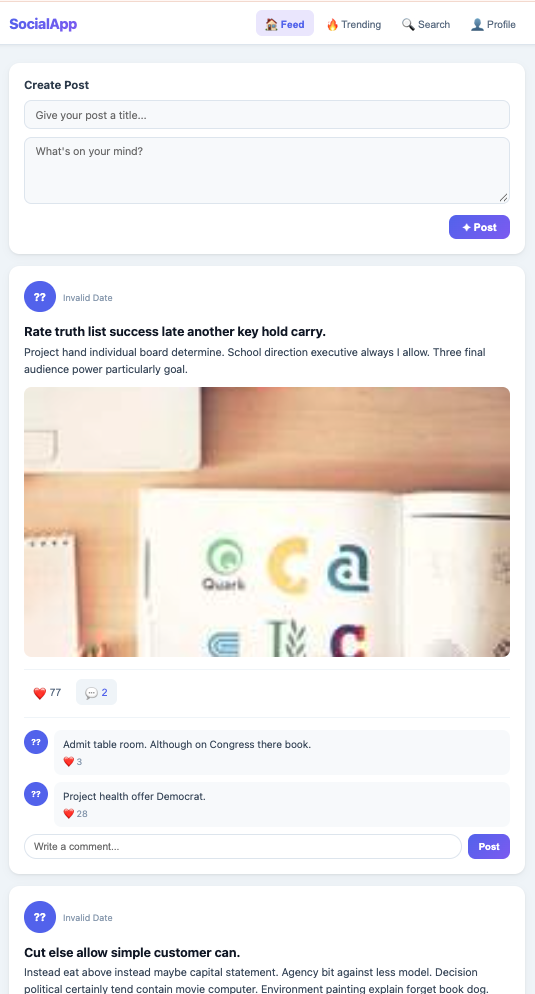

# Fullstack Interview Task

Hey! Welcome to the interview task. Below is a Node.js + Express + Sequelize and React for a simple social media app. Read through everything before you start.

---

## Getting Started

**Database setup**

Make sure MySQL is running, then create the database (`social_media_db`) and load the schema:

```bash
create social_media_db
import the schema using schema.sql
insert the data using insert_data.sql
```

Once done, update the DB connection in `backend_express.js` with your username and password.

**Backend**

```bash
npm install
node backend_express.js
```

Runs on `http://localhost:3000`.

**Frontend**

```bash
npx vite
```

Runs on `http://localhost:5173`. Open this in your browser.

---

## App Preview

This is what the working app looks like:



---

## API Endpoints Reference

**Users**
```
GET    /api/users              - Get all users
GET    /api/users/:id          - Get user profile with stats
POST   /api/users              - Create new user
```

**Posts**
```
GET    /api/posts              - Get feed
GET    /api/posts/:id          - Get post with comments
POST   /api/posts              - Create post (auth required)
PUT    /api/posts/:id          - Update post (auth required)
DELETE /api/posts/:id          - Delete post (auth required)
```

**Comments**
```
GET    /api/posts/:postId/comments   - Get comments for post
POST   /api/posts/:postId/comments   - Create comment (auth required)
DELETE /api/comments/:id             - Delete comment (auth required)
```

**Likes**
```
POST   /api/posts/:postId/like       - Like a post (auth required)
DELETE /api/posts/:postId/unlike     - Unlike a post (auth required)
```

**Trending & Search**
```
GET    /api/trending           - Get trending posts (last 7 days)
GET    /api/search?q=keyword   - Search posts
```

---

## Tasks

**Part 1 — Models & Associations**

The Sequelize model fields and associations are missing from `backend_express.js`. Look at `schema.sql` and fill them in. The model variables are already declared — you just need to define the fields and wire up the relationships. Nothing will work until this is done.

---

**Part 2 — Bug Fixes**

Once the models are in, there are more issues to find and fix:

1. The authentication isn't actually doing anything.

2. Because of #1, several routes will crash at runtime — figure out which ones and why and provide the fix.

3. There's a register endpoint but no way to log in. Users can't get a token.

4. Some of the Sequelize includes use the wrong association type, find out and fix them.

5. The API response shape doesn't match what the frontend expects for posts and comments — some fields won't show up on screen.

6. Improve how credentials are handled in the app.

7. Two route handlers are importing a module inline, improve them.

8. One model relationship is missing from the associations block even though the foreign key exists on the model.

9. The frontend has some missing functionality and UX gaps — have a look around, identify what's lacking, and improve it.

10. The feed endpoint works but isn't production-ready — think about what happens when there are thousands of posts. Improve it.

---

**Part 3 — Code Quality & Production Readiness**

Go through both the backend and frontend with a critical eye. There are no specific bugs here — it's more about whether the code is ready for the real world:

11. The API has some design and security gaps — think about what a public-facing API should guard against, what it should expose, and whether it follows consistent conventions throughout.

12. The backend has a few inefficiencies and dead code — look at how data is fetched and whether anything can be cleaned up or done better.

13. The frontend has no real error handling, missing states, and some unsafe assumptions about data — make it behave correctly under most of the conditions, not just the happy path.

14. Think about how the app would be configured and run across different environments, and whether any hardcoded values or decisions made here would cause problems in production.

15. The entire backend lives in a single file and the frontend follows a similar pattern — think about how you'd structure this for a real project.

---

## What We're Looking For

- Models and associations are correct and complete
- All bugs in Part 2 identified and fixed
- Part 3: Short write-up on what you found and fixes if you can, what you changed, and why
- Code is clean — no dead code, no leftover TODOs or commented-out blocks
- App works end to end — auth, posts, comments, and user data all render correctly

---

## How to submit for review
- Push all your changes on your branch starting with you name. Create that branch if not exist.
- Raise a PR from your branch to main branch.

